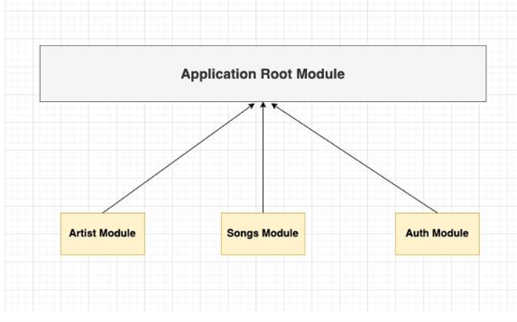
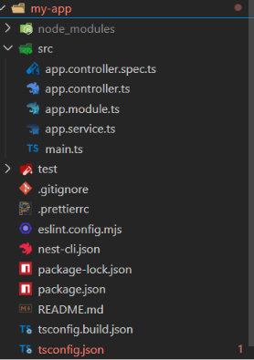
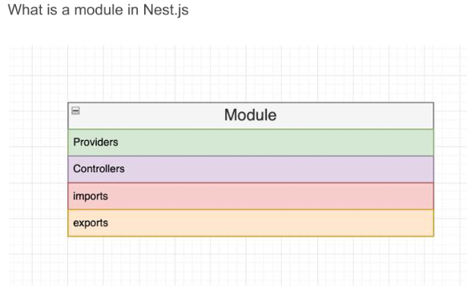

# What is NestJS?

NestJS is a progressive Node.js framework that uses:

TypeScript by default
Dependency Injection (DI)
Modular architecture
Decorators
Built-in support for APIs, WebSockets, GraphQL, microservices,

It is built on top of Express (by default) and deeply utilizes TypeScript to provide strong typing and better code quality.

It adopts design patterns from Angular. This means it uses things like Decorators (@Controller(), @Injectable())

# Install Nest CLI
for using the nest in our project

```npm install -g @nestjs/cli```
 
## starting new project 
```nest new my-app
  cd my-app
```
->will create the following files
then go inside my-app dir to start working with our project/app

```my-app/
│
├── src/
│   ├── app.controller.ts
│   ├── app.service.ts
│   ├── app.module.ts
│   └── main.ts
│
├── test/
├── package.json
├── tsconfig.json
├── nest-cli.json
└── README.md
```
* main.ts : this is the start the server at port 3000 
 ```import { NestFactory } from '@nestjs/core';
import { AppModule } from './app.module';

async function bootstrap() {
  const app = await NestFactory.create(AppModule);
  await app.listen(process.env.PORT ?? 3000);
}
bootstrap();
```
* app.controller.ts:
  Controllers are responsible for request handling and response sending, acting as a gateway between the client and server. This file currently contains a single route that handles your GET request and returns "Hello World!".

  current thing in this file

``` import { Controller, Get } from '@nestjs/common';
import { AppService } from './app.service';  // it is called from the app.service file that contain the hello word

@Controller()
export class AppController {
  constructor(private readonly appService: AppService) {}

  @Get()
  getHello(): string {
    return this.appService.getHello();
  }
}
```
here basicly all the @get @ post @delete @ put thing are handelled  so it listen for the request from the user 

and then call the service according to the request and like this we can create multiple conroller for each modules and the here the app module is the main moduel of this whole app 



so this is an example of simple spotify like app module details 

* app.service.ts : Services encapsulate your business logic. If you look at this file, you'll see the function that actually returns the "Hello World!" string. The controller calls this service, promoting "Separation of Concerns".

means like the main logic od the service provided by app is wrriten in this file in intail it just shows hello word 

to saw this we need to start our app after intializing thing ```npm run start:dev```

after intailzng with ```npm new project_name``` we will get files like this 


* test folder is for testing our app dont need to look that now 

* in src/ the controller.spec.ts is for testing app moduel sperately

# Modules 




here in this each featuer is module like 
auth module , user moduel , login moduel like that eah thing has spearte controller ,service and modules 

-> everthing is conrolled  by app moduel the whole project 

### Creating other featuers 

creating user module use this command ```nest g co songs --no-spec```

* co stands for controller. Adding --no-spec tells the CLI not to create the test file, keeping our folder clean just like you wanted

then add some code in it 

* Open src/songs/songs.controller.ts. Let's add some routes for our API:

```import { Controller, Get, Post, Delete, Put } from '@nestjs/common';

@Controller('songs') // This means all routes inside this controller start with /songs
export class SongsController {

  @Post()
  createSong() {
    return 'This action adds a new song';
  }

  @Get()
  findAllSongs() {
    return 'This action returns all songs';
  }

  @Get(':id')
  findOneSong() {
    return 'This action returns a single song based on ID';
  }

  @Put(':id')
  updateSong() {
    return 'This action updates a song';
  }

  @Delete(':id')
  deleteSong() {
    return 'This action deletes a song';
  }
}
```
* then creating service ```nest g s songs --no-spec```
 s for service 

 ```import { Injectable } from '@nestjs/common';

@Injectable() // This decorator makes it a provider that can be injected into controllers
export class SongsService {
  // Temporary local array data
  private readonly songs: string[] = ['Bohemian Rhapsody', 'Hotel California', 'Blinding Lights'];

  create(song: string) {
    this.songs.push(song);
    return `Song "${song}" added successfully!`;
  }

  findAll() {
    return this.songs;
  }
}
```
---> connect the controller and the service by going to controller
* Go back to src/songs/songs.controller.ts and update it to look like this:

```import { Controller, Get, Post, Body } from '@nestjs/common';
import { SongsService } from './songs.service'; // 1. Import the service

@Controller('songs')
export class SongsController {
  // 2. Inject the service via the constructor
  constructor(private songsService: SongsService) {}

  @Post()
  createSong(@Body('title') title: string) { // @Body extracts the payload from the request
    return this.songsService.create(title);   // 3. Call service method
  }

  @Get()
  findAllSongs() {
    return this.songsService.findAll();       // 3. Call service method
  }
}
```
## INnsted of this we  create Generate a complete resource (Module + Controller + Service + DTO)

 using --> ```nest g resource user``` or songs 

```It will ask:

? What transport layer do you use?
❯ REST API

Then:

? Would you like to generate CRUD entry points?
❯ Yes
```

then it will create file like this

```src/user/
├── dto/
│   ├── create-user.dto.ts
│   └── update-user.dto.ts
├── entities/
│   └── user.entity.ts
├── users.controller.ts
├── users.service.ts
├── users.module.ts
└── users.controller.spec.ts
└── users.service.spec.ts
```

